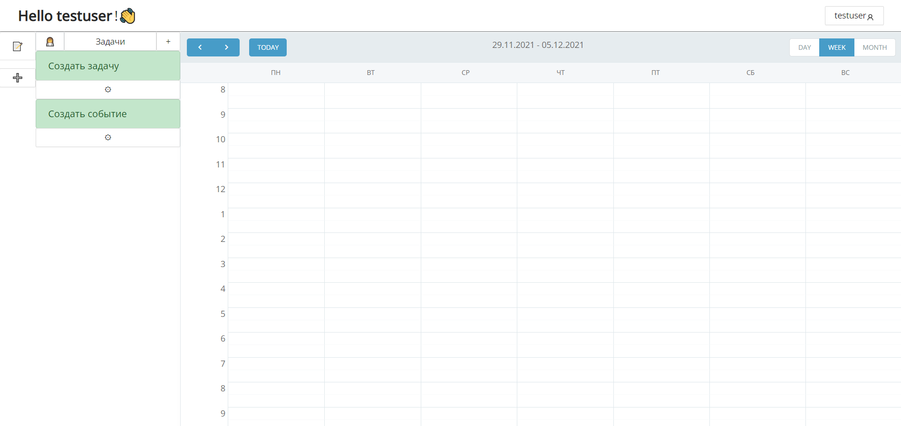

# ChadWebCalendar
ChadWebCalendar - веб-приложение, которое намерено облегчить жизнь фрилансерам, студентам и всем тем, кто хочет быть более организованным. Приложение объединяет в себе календарь, список задач и функцию автоматического составления расписания.

## Стек используемых технологий
* C#
* ORM - Entity Framework Core 5.0
* HTML и CSS
* Blazor Server
* Radzen Blazor
* SQLite

## Как пользоваться
Доступ к приложению осуществляется через браузер. После установки пользователь должен зарегистрироваться и приступить к использованию, указав время рабочего дня. В самом начале у вас будет создан проект по умолчанию, в котором будут две демонстрационные задачи. 

Если вы запускаете проект, скачав с Github, то в IDE для запуска нужно выбрать проект ChadWebCalendae

### Функции
* Регистрация и авторизация пользователя;
* CRUD (создание, чтение, редактирование и удаление) задач, проектов и событий;
* Распределение задач пользователя по трем принципам: 
    + Равномерно;
    + Максимум в начале рабочего дня;
    + Максимум в конце рабочего дня.
*  Напоминания о приближающемся событии.

## Команда
* [Евгений](https://t.me/eukuz)
* [Алмаз Сахабиев](https://t.me/Defourten)
* [Алмаз Ахмадуллин](https://t.me/almazix)
* [Руслан](https://t.me/auter1)
* [Александр](https://t.me/full_dark)

